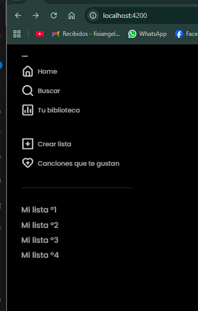

# Labo angular - Clone de Spotify

## Instalacion de software

1. Instalar node
   - `node -v`
   - npm -v

Instalar angular
npm install -g @angular/cli
ng v  //version de angular

---

## Creacion de proyecto

ng new name-aplicacion  //Para crear 1 proyecto

ng new Spotify --routing --style=css   //esta opcion es para q escoga  css y routing pero igual hace otras preguntas de zone y ia, etc

ng serve   //Para iniciar el servidor de desarrollo

Entramos a la ruta q nos indica
http://localhost:4200/  y veremos la pagina de inicio

Para cambiar de puerto
ng s --port=4100

Para compartir con cualquier host, hay q ver la ip de la maquina donde se despliega
ng s --host=0.0.0.0 --port=4100

---

//Tipos de datos en Typescript
let nombre: string = 'Spotify';
let edad: number = 20;

---

* Agrega fonts y iconos
* Usar dataset para datos tpo json
  de aqui saco la data q usare en la app

“compilerOptions”: {
“resolveJsonModule”: true,
“baseUrl”: “./”,
agregasmos esto para evitar pbugs con los json

---

## Branding

Agregamos los estilos en style.css
Se usaran variables css para todo el proyecto

---

## Scaffolding o estructuracion

Verificar contenido de src/app

Directorio de C:\sm\spotify-angular\src\app

03/10/2025  10:25               412 app.config.ts
03/10/2025  10:25                 0 app.css               *CSS*
03/10/2025  11:35                87 app.html             *HTML*
03/10/2025  10:25                80 app.routes.ts         *Rutas*
03/10/2025  10:25               696 app.spec.ts            *Pruebas*
03/10/2025  11:36               309 app.ts                *TypeScript*
03/10/2025  11:37    <DIR>          data

Usamos app.ts (antes era app.component.ts)

import { Component, signal } from '@angular/core';
import { RouterOutlet } from '@angular/router';

```
@Component({
    selector: 'app-root',
    imports: [RouterOutlet],
    templateUrl: './app.html',
    styleUrl: './app.css'
})
```

export class App {
protected readonly title = signal('Spotify');
}

Segun me explico mi curso el @Component es un decorador q va includo a la Clase,
y realaciona la etiquera, template, estilo, y import van otros components

Aparte en la parte de clase va la logica en Typescript

Ahora vamos con el Scaffolding: o estructura
crear carpetas
src/app
-core
-modules
-shared
-data

“En Angular actual (standalone) ya no se utilizan NgModules,
por lo que la funcionalidad modular se implementa directamente con componentes independientes
y lazy loading con loadComponent.”

Borrar todo el contenido generado por angular en app.html y dejar solo
<router-outlet />

esta realcionado con app.route.ts //ahi van las rutas

index.html = la puerta de entrada (tiene <app-root>).

main.ts = el motor que arranca Angular y dice “pinta App en <app-root>”.

app.html = lo que realmente ves en pantalla (el contenedor principal de la app).

---

## Componentes

cree 1 carpeta pages y para cada componente luego tanb los cree

* ng generate component pages/history --standalone
  ya tanbn cree las rutas con loadComponent

crear componentes de prueba
ng g c ruta/ejemplo

ng g c pages/home/home-page --standalone --inline-style=false --inline-template=false --flat
ng g c pages/favorites/favorite-page --standalone --inline-style=false --inline-template=false --flat
ng g c pages/history/history-page --standalone --inline-style=false --inline-template=false --flat
ng g c pages/tracks/tracks-page --standalone --inline-style=false --inline-template=false --flat

para q no cree otra carpeta con el mismo nombre

Directorio de D:\proyectos-2025\sm\Spotify\src\app\example

15/09/2025  11:18    <DIR>          .
15/09/2025  11:18    <DIR>          ..
15/09/2025  11:18                 0 example.css                 //CSS
15/09/2025  11:18                23 example.html                //HTML template
15/09/2025  11:18               558 example.spec.ts             //pruebas unitarias
15/09/2025  11:18               200 example.ts                  //Logica en TS

Editamos el html para mostrar un mensaje

y luego en app.route.ts agregamos la ruta
{
path: '',
component: Example
}

nos dira q hagamos un import, iniciamos el server y veremos nuestro " Hola mundo "

Recorda que ya sea 1 ruta u usar 1 componente dentro de otro
se debe importar antes.

---

Luego sobre la estructura
cramos el sidebar, header y  media-player en shared\components

Luego el hace lazyload pero lo haremos como loadComponent y sin modulos, asi:

```
path: '',
    loadComponent: () => import('./pages/home/home').then(m => m.Home)
```

---

podemos agregar alias para las rutas

"baseUrl": "./src",
"paths": {
"@core/*": ["app/core/*"],
"@pages/*": ["app/pages/*"],
"@shared/*": ["app/shared/*"],
"@layout/*": ["app/layout/*"],
"@data/*": ["app/data/*"]
},en tsconfig.app.json

y cambiamos los import asi

import { Sidebar } from '@core/sidebar/sidebar';  //alias

Luego en nuestro caso hacemos un componente Layout q tendra el sidebar y mediaplayer, q no cambian y dentro las paginas q cambian
auth, favorites, home,etc. En el laboratorio lo realiza todo dentro de home

Sobre el css del componente se usan BEM para nombrarlos
Tanbn se usan variables definidas en el TS y q se recorren con ngfor en html para armar el menu
queda asi

| Componente / Archivo | Función                                                      |
| -------------------- | ------------------------------------------------------------ |
| `layout/`            | Estructura fija (sidebar, media-player, outlet)              |
| `sidebar/`           | Navegación lateral del usuario                               |
| `media-player/`      | Controles inferiores (por ahora vacío)                       |
| `app.routes.ts`      | Define rutas con `Layout` para home y sin `Layout` para auth |
| `auth/`              | Página de login / acceso (sin sidebar ni player)             |





| Concepto Angular | Qué hace                          | Dónde lo usaste                  |
| ---------------- | --------------------------------- | -------------------------------- |
| `@Component`     | Define un componente              | Todos                            |
| `@Input()`       | Recibe datos del padre            | `section-generic`, `card-player` |
| `*ngFor`         | Repite elementos                  | `sidebar`, `section-generic`     |
| `*ngIf`          | Muestra / oculta contenido        | `media-player` (más adelante)    |
| `[ngClass]`      | Aplica clases dinámicas           | `sidebar`, `section-generic`     |
| `RouterOutlet`   | Carga rutas hijas                 | `layout`                         |
| `loadComponent`  | Carga componente según la ruta    | `app.routes.ts`                  |
| `OnInit`         | Se ejecuta al crear el componente | `sidebar`, `layout`              |
| `Layout`         | Estructura base persistente       | `layout.html`                    |

luego creamos 2 componente mas section-generic y card-player q usaremo en tracks
y usaremos input para poder mandar variables
de padre -> hijo, esto es la comunicacion entre componentes


Paso 27, creamos interfaces, que define 1 objeto y los campos q debe tener este
esto con el fin de que ts detecte errores
la data por el momento viene de un tracks.json, posterior sera de un API

en page de favoritos, usamos lo mismo cramos 2 componentes para el header y body
usamos lo q sabemos
HTML + CSS
Tanbn usamos el json para la data y la interface

usamo algo nuevo, odemos parasar 1 varible al ngtemplate y mandarle datos del ngcontainer

Luego vemos navegacion con Routerlink 

🔥 Perfecto, Angel — acabas de entrar en **una de las partes más potentes de Angular**:
el enrutamiento dinámico con **`[routerLink]`**.
Este paso (29) es clave porque conecta tu **sidebar** con las **páginas reales**.
Vamos a repasarlo bien para que te quede clarísimo 👇

---

## 🧭 1. Qué hace `[routerLink]`

La directiva `[routerLink]` **reemplaza los `<a href="">` tradicionales**,
pero **sin recargar la página completa** — solo cambia el componente que se muestra dentro del `<router-outlet>`.

Por ejemplo:

```html
<li *ngFor="let item of mainMenu.defaultOptions">
  <div class="list-wrapper-item" [routerLink]="item.router">
    <i [ngClass]="['uil', item.icon]"></i>
    <span class="side-bar__list list-label">{{item.name}}</span>
  </div>
</li>
```

➡️ Cada `item.router` es un **array o string** con la ruta configurada en tu `app.routes.ts`.
Cuando haces clic, Angular **renderiza el componente correspondiente** dentro del `<router-outlet>` del layout,
sin hacer una nueva petición HTTP al servidor.

---

## 🧩 2. Qué cambió en tu sidebar.ts

Agregaste algo como esto:

```ts
mainMenu = {
  defaultOptions: [
    {
      name: 'Home',
      icon: 'uil uil-estate',
      router: ['/tracks']
    },
    {
      name: 'Buscar',
      icon: 'uil uil-search',
      router: ['/history']
    },
    {
      name: 'Tu biblioteca',
      icon: 'uil uil-chart',
      router: ['/favorites']
    }
  ],
  accessLink: [
    { name: 'Crear playlist', icon: 'uil uil-plus' },
    { name: 'Canciones que te gustan', icon: 'uil uil-heart' }
  ]
};
```

✔️ Cada `router` apunta a una ruta real
✔️ Así conectas tu **Sidebar** → con las **Pages (`TracksPage`, `FavoritesPage`, etc.)**

---

## 🧠 3. Qué hace `RouterLink`

* Se comunica con el **Router interno de Angular**
* Cambia la URL sin recargar
* Le dice al `<router-outlet>` qué componente debe mostrar

---

## 🧩 4. Asegúrate de importar `RouterLink` (solo una vez por componente)

En tu `sidebar.ts`:

```ts
import { Component } from '@angular/core';
import { CommonModule } from '@angular/common';
import { RouterLink } from '@angular/router';

@Component({
  selector: 'app-side-bar',
  standalone: true,
  imports: [CommonModule, RouterLink],
  templateUrl: './side-bar.html',
  styleUrl: './side-bar.css',
})
export class SideBar { ... }
```

Sin eso, te saldría el clásico error:

> “Can’t bind to ‘routerLink’ since it isn’t a known property…”

---

## 🧱 5. En tu layout

Asegúrate que tu `<router-outlet>` esté en el layout:

```html
<div class="layout">
  <app-side-bar></app-side-bar>
  <main class="content">
    <router-outlet></router-outlet>
  </main>
  <app-media-player></app-media-player>
</div>
```

Así cuando haces clic en “Home”, “Buscar”, “Favoritos”…
se reemplaza solo la parte dentro del `<router-outlet>` 🎯

---

## 🧩 6. Verifica tus rutas (`app.routes.ts`)

Debe lucir más o menos así:

```ts
import { Routes } from '@angular/router';
import { Layout } from './layout/layout';
import { TracksPage } from './pages/tracks/tracks-page';
import { FavoritesPage } from './pages/favorites/favorite-page';
import { HistoryPage } from './pages/history/history-page';

export const routes: Routes = [
  {
    path: '',
    component: Layout,
    children: [
      { path: '', redirectTo: 'tracks', pathMatch: 'full' },
      { path: 'tracks', component: TracksPage },
      { path: 'favorites', component: FavoritesPage },
      { path: 'history', component: HistoryPage }
    ]
  }
];
```

---

## ✅ En resumen

| Elemento          | Función                                 |
| ----------------- | --------------------------------------- |
| `[routerLink]`    | Cambia la vista sin recargar            |
| `RouterLink`      | Directiva que maneja navegación         |
| `<router-outlet>` | Muestra el componente activo            |
| `routes.ts`       | Define qué componente carga cada ruta   |
| `Layout`          | Permite mantener sidebar y player fijos |

---

## Pipe

ng g p shared/pipe/orderList
CREATE src/app/shared/pipe/order-list-pipe.spec.ts (208 bytes)
CREATE src/app/shared/pipe/order-list-pipe.ts (235 bytes)

eventos

| Evento                          | Cuándo se dispara                                | Ejemplo                       |
| ------------------------------- | ------------------------------------------------ | ----------------------------- |
| `(click)`                       | cuando se hace clic                              | `(click)="playSong()"`        |
| `(dblclick)`                    | doble clic                                       | `(dblclick)="zoomImage()"`    |
| `(input)`                       | cada vez que se cambia el valor de un input      | `(input)="onChange($event)"`  |
| `(change)`                      | cuando un input pierde el foco y su valor cambió | `(change)="onSelect($event)"` |
| `(submit)`                      | al enviar un formulario                          | `(submit)="onSubmit()"`       |
| `(mouseenter)` / `(mouseleave)` | al entrar o salir el puntero del mouse           | `(mouseenter)="hover = true"` |
| `(keydown)` / `(keyup)`         | al presionar o soltar una tecla                  | `(keydown)="onKey($event)"`   |
| `(focus)` / `(blur)`            | cuando un input gana o pierde el foco            | `(focus)="onFocus()"`         |


| Línea                                     | Explicación                                                                                                                                                                              |
| ----------------------------------------- | ---------------------------------------------------------------------------------------------------------------------------------------------------------------------------------------- |
| `changSort(property: string): void`       | Declara una función llamada `changSort` que recibe un **texto** (`property`) y no devuelve nada (`void`).<br>Ejemplo: cuando haces `(click)="changSort('name')"` estás pasando `'name'`. |
| `const {order} = this.optionSort;`        | Usa **desestructuración de objetos** (JS moderno).<br>Extrae la propiedad `order` de `this.optionSort`.<br>Es como si hicieras:<br>`const order = this.optionSort.order;`                |
| `this.optionSort = { ... }`               | Aquí reasignas el objeto `optionSort` con nuevos valores. Angular detectará el cambio y actualizará la vista.                                                                            |
| `property,`                               | Esto en JS moderno equivale a `property: property`. Asigna el argumento que le pasaste (`'name'`, `'album'`, etc.) al campo `property` del objeto.                                       |
| `order: order === 'asc' ? 'desc' : 'asc'` | Aquí está el truco: el **operador ternario**.<br>👉 Si el orden actual es `'asc'`, lo cambia a `'desc'`.<br>👉 Si no, lo cambia a `'asc'`.<br>Es una forma corta de escribir un `if`.    |


---


🧠 Ejemplo visual de lo que pasa:

Imagina que al iniciar:

optionSort = {property: null, order: 'asc'}


👉 Clic en “Nombre”:

changSort('name')
→ optionSort = {property: 'name', order: 'desc'}


👉 Clic otra vez en “Nombre”:

changSort('name')
→ optionSort = {property: 'name', order: 'asc'}


👉 Clic ahora en “Álbum”:

changSort('album')
→ optionSort = {property: 'album', order: 'desc'}


Así Angular sabe qué columna ordenar y en qué dirección — y el pipe (orderList) usa justo esos valores.

🧩 En resumen:

optionSort = estado del orden (qué propiedad y en qué dirección).

changSort() = cambia el estado.

Angular detecta el cambio y el pipe vuelve a ordenar el arreglo automáticamente.


Angular funciona así:

En el HTML tienes

*ngFor="let track of tracks | orderList:optionSort.property:optionSort.order"


👉 Esto le dice a Angular: “pásale la lista de tracks al pipe orderList, junto con esas dos variables”.

Cada vez que optionSort cambia (por el (click) en el encabezado), Angular vuelve a ejecutar el pipe.
El pipe compara los valores del array y devuelve una nueva versión ordenada.

Angular re-renderiza el DOM automáticamente con ese nuevo array.

Así que sí:

La lógica de ordenación vive en el pipe.

La elección de qué ordenar vive en el componente (con optionSort).

La actualización visual la hace Angular al detectar el cambio. ✅

---


## Directivas

ng g d shared/directives/ImgBroken
CREATE src/app/shared/directives/img-broken.spec.ts (208 bytes)
CREATE src/app/shared/directives/img-broken.ts (148 bytes)